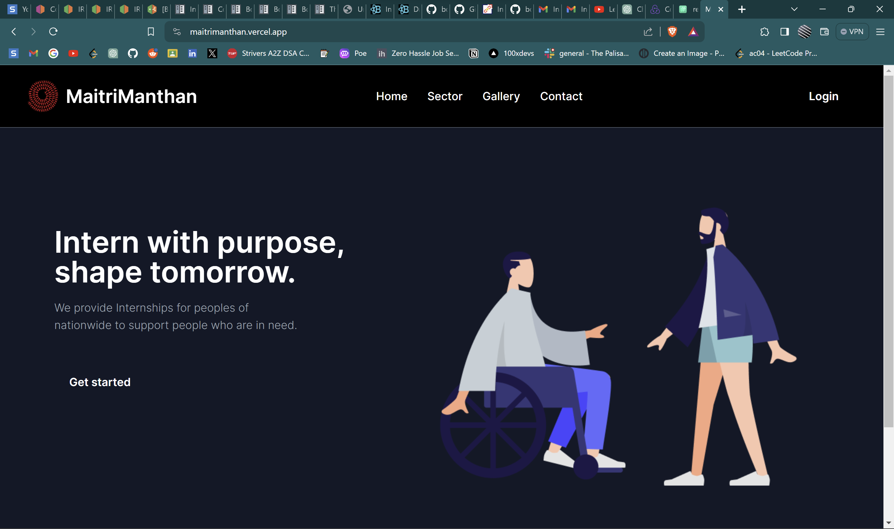
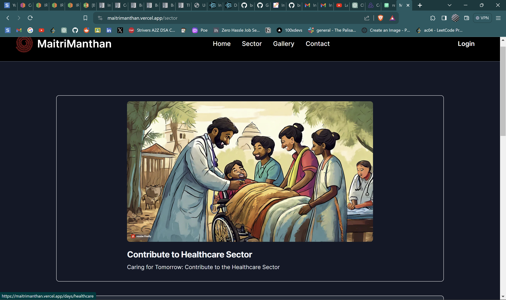
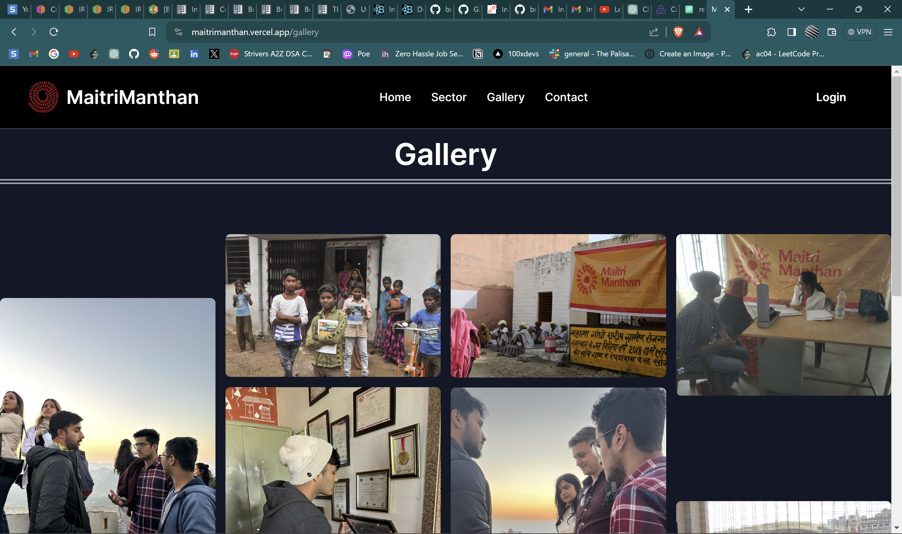
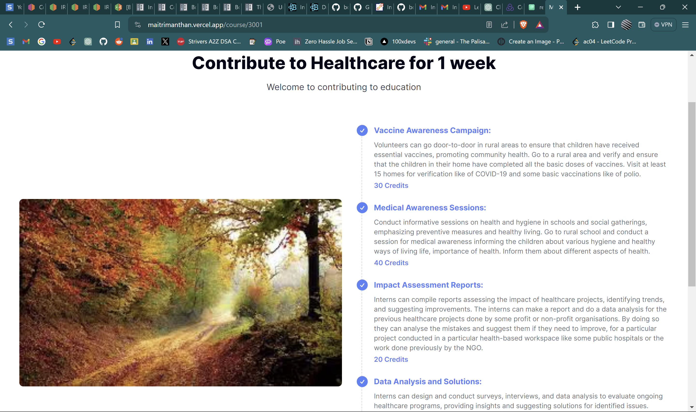
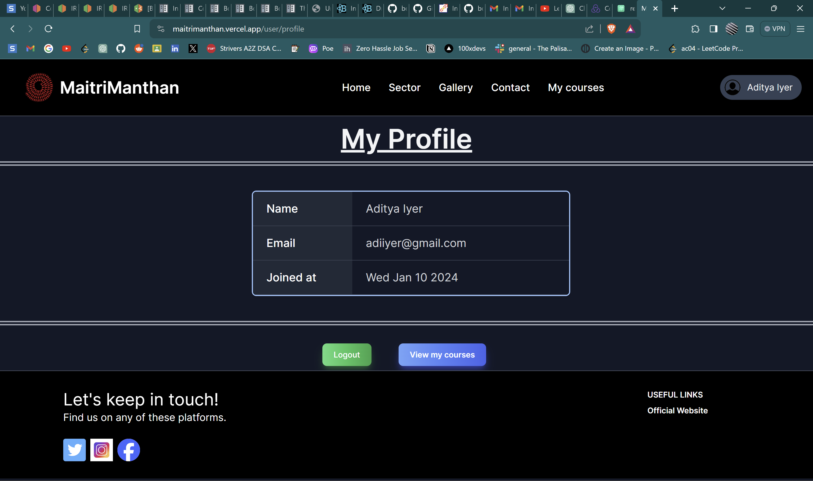

# Maitri Manthan Internship Portal

A portal designed to enable people to join as an intern at the organisation. This was my main project while working as an intern for Maitri Manthan.


## Deployment

This project is deployed. You can visit the link below for more details

https://maitrimanthan.vercel.app/


## How to Join

    1. Create an account in the website.
    2. Go to the secotrs page and select a sector you   would like to contribute to.
    3. Select the duration of your internship.
    4. You are now enrolled in an internship! Look at your tasks and submit them with the help of attached forms.

## Table of Contents

- [Screenshots](#screenshots)
- [Features](#features)
- [Installation](#installation)
- [Usage](#usage)
- [Contributing](#contributing)
- [License](#license)

## Screenshots







## Features


- Secure authentication for user accounts.
- Diverse global internships and remote opportunities.
- Huge variety of courses.
- Certificates issued upon successful completion of internships.
- Accessibility from anywhere in the world.
- User-friendly interface with personalized profiles.
- Feedback mechanisms for continuous improvement.

## Installation


Follow these steps to set up and run the Next.js website locally on your machine.

####  Prerequisites

Before you begin, make sure you have the following installed on your machine:

- [Node.js](https://nodejs.org/) (version 14 or later)
- [npm](https://www.npmjs.com/) (usually comes with Node.js installation)

#### Clone the Repository

Clone the GitHub repository to your local machine using the following command:

```bash
git clone https://github.com/your-username/maitrimanthan.git
```


Change into the project directory:

```bash
cd client
```

#### Install Dependencies

Install the project dependencies using npm:

```bash
npm install
```

#### Configure Environment Variables


Add a `.env.local` file and add your configuration values.

#### Run the Development Server

Start the Next.js development server:

```bash
npm run dev
```

Open your browser and visit [http://localhost:3000](http://localhost:3000) to view your Next.js website.


## Contributing

Contributions are always welcome!


Please let me know if you find any bug or issues.


## License

This project is licensed under the MIT License - see the `LICENSE` file for details.


## Acknowledgements

- Special thanks to Maitri Manthan Sansthan  for providing me with an opportunity to build their website.


## Author

- Name: Abhishek Abbi
- Github: [@aabbi15](https://www.github.com/aabbi15)
- Mail: abhishekabbi.work@gmail.com
- X: [@aabbi_work](https://twitter.com/aabbi_work)


